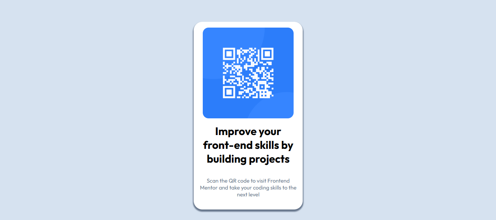

# Frontend Mentor - QR code component solution

This is a solution to the [QR code component challenge on Frontend Mentor](https://www.frontendmentor.io/challenges/qr-code-component-iux_sIO_H). Frontend Mentor challenges help you improve your coding skills by building realistic projects. 

## Table of contents

- [Overview](#overview)
  - [Links](#links)
- [My process](#my-process)
  - [Built with](#built-with)
  - [What I learned](#what-i-learned)
  - [Continued development](#continued-development)
  - [Useful resources](#useful-resources)
- [Author](#author)
- [Acknowledgments](#acknowledgments)

## Overview

### Links

- Solution URL: [QR CODE COMPONENT HTML/CSS](https://www.frontendmentor.io/solutions/qr-code-component-htmlcss-U0lCUz1E7z)
- Live Site URL: [https://maurodev35.github.io/QR-CODE-COMPONENT/](https://maurodev35.github.io/QR-CODE-COMPONENT/)

## My process

I finished the HTML code adding some semantic tags as well as re bundling the information as needed in order to make it easier when implementing the CSS, I created a CSS file and linked it to the HTML file. Then, started to write down the CSS custom properties in order to achieve the design proposed in the project finally added some details to the project.

### Built with

- Semantic HTML5 markup
- CSS custom properties
- Flexbox
- Mobile-first workflow

### What I learned

I have practiced my HTML and CSS skills with this project and helping get settled the bases but the main thing I learned is how to use flexbox in order to order my components.

### Continued development

I would like to keep focusing in improving my HTML and CSS skills as well as the design area while I also learn and practice more about JS and React skills.

### Useful resources

- [CSS Resource](https://10015.io/tools/css-box-shadow-generator) - This helped me creating the shadow for the card so it will look as I wanted and more important showing a preview of how it should look like.

## Author

- Frontend Mentor - [@MauroDev35](https://www.frontendmentor.io/profile/MauroDev35)
- LinkedIn - [Andrés Mauricio Páez Vergara](https://www.linkedin.com/in/maurodev35/)

## Acknowledgments

I didn't follow any specific inspiration or someone else project as guideline but I do appreaciate all the stuff and important things I have learned at CoderHouse.
